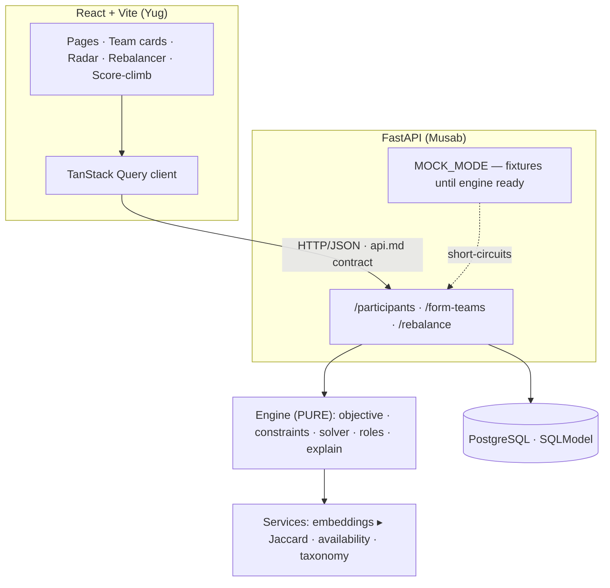

# TeamForge — Project Master Document (reconciled v1.1, standalone)

> **The single source of truth for the entire project.** Self-contained: architecture, product model, engine spec, data model, the full API contract, feature roadmap, ownership, development plan, demo strategy, and team process — everything needed to build, with no other document required open.
>
> This merges two independently-written plans — the process/discipline spine (from the SYNC'D `PROJECT.md`) and the cohort-partition engine (from the earlier SPEC/ARCHITECTURE work). Where they diverged, §1 records every decision and its reason.

---

## ⚠️ Read this first — the one decision that was resolved

The two source plans quietly described **two different products**:

- **"Project seeks team"** — one project posts requirements, the system semantic-searches a candidate pool and assembles a fitting team. (Recruiting / matching.)
- **"Partition the cohort"** — ~48 participants exist, and the system splits *all of them* into balanced teams so everyone is placed. (Global optimization.)

**Resolution: the core product is cohort partitioning.** Project-fit is folded in as a *scoring term*, not the driving retrieval step. This matches the brief's dominant framing ("recommends balanced teams instead of ranking individuals," "diversity of capabilities," "identify missing roles," fairness) and keeps us out of the ranked-candidate-list trap. The LLM/embedding work from the other plan is preserved — re-sequenced as an *enhancement layer*, not the MVP core.

**Name:** this document uses **TeamForge**; **SYNC'D** is the alternative. Pick one together before the first commit and find-replace. Everything else here is name-agnostic.

---

## 1. Reconciliation decisions (what we merged, and why)

| Question | The two plans said | Decision | Why |
|---|---|---|---|
| Product model | project→candidates vs cohort→teams | **Cohort partition** is core; project-fit is a score term | Matches the brief; avoids the candidate-ranking trap |
| Semantic search (pgvector) | Load-bearing MVP retrieval | **Phase 2 enhancement**, off by default | At ~48 people you *have* everyone; retrieval isn't the hard part — the partition is |
| LLM requirement/profile extraction | MVP | **Keep in MVP** (free-text → structured) | Cheap, high-value, reads as "intelligent" |
| Redundancy penalty | Absent (complementarity was reward-only) | **Add `skill_redundancy` penalty** | Without it, five AI engineers can still win — the Team A/B example isn't guaranteed by the math |
| Availability | Soft 10% score | **Hard feasibility constraint** + timezone overlap | A team that can't meet is worthless, not merely lower-scoring |
| Auth | Real JWT in foundation | **Faked** (identity switcher), no login | Real auth is wasted hours in a hackathon |
| Fairness (everyone placed) | Absent (project-centric) | **Guaranteed + displayed** | Differentiator; structural to the partition model |
| Optimizer | "combinations → optimize" (hand-waved) | **OR-Tools CP-SAT ▸ local search**, with a step log | The moat must be specified, not hand-waved |
| Demo centerpiece | Static 94/100 + why-list | **Rebalancer** (remove→gap→heal) | One live interaction that proves the whole intelligence stack |
| Process discipline | Strong (SoT hierarchy, DoD, git, comms) | **Kept in full** (§19–§23) | This was the better half of the other plan — keep it |

Nothing from either plan is discarded: the LLM/pgvector work becomes an enhancement, and the process spine is adopted wholesale.

---

## 2. Product identity

**TeamForge** — *Build better teams, not just bigger teams.*

An intelligent team-formation platform that partitions a cohort of participants into **balanced** teams — optimizing for complementary skills, role coverage, real availability overlap, goal alignment, and individual preferences — then explains every team and lets a human rebalance it. It treats team formation as a **global optimization problem**, not a candidate search.

**Core differentiator — we don't find the best individuals, we find the best combination.**

| Team A | Team B |
|---|---|
| AI Engineer | AI Engineer |
| AI Engineer | Backend Developer |
| AI Engineer | Frontend Developer |
| AI Engineer | UI/UX Designer |
| High individual scores, poor coverage | Lower individual scores, strong coverage + complementarity |

TeamForge scores **Team B above Team A** — because the objective explicitly *penalizes* redundancy and *rewards* coverage. That single property is the whole product; §5.1 makes the math guarantee it.

---

## 3. Problem statement

Teams today are formed by friends and networks, manual searching, keyword skill-matching, random assignment, or individual skill ranking. None of these answer the real question:

> **Which combination of people will work best together for this specific context?**

A group of highly skilled individuals still performs poorly when everyone shares the same skills, when critical roles (frontend, design, AI, deployment) are missing, or when the team literally cannot find overlapping hours to meet. TeamForge treats formation as an optimization problem over the whole cohort, under real-world constraints.

---

## 4. Product goals

1. Understand each participant's capabilities from structured input and free text.
2. Partition the whole cohort into viable, balanced teams — nobody left out.
3. Reward complementarity and coverage; penalize redundancy.
4. Treat availability as a hard feasibility constraint, not a soft preference.
5. Detect skill gaps and missing roles per team.
6. Explain, in plain language, why each team was formed.
7. Let a human accept, reject, or rebalance teams and see the score change live.
8. Guarantee fairness: everyone placed, no team non-viable, every person gets ≥1 interest match where feasible.
9. (Phase 2+) support project-anchored forming, alternatives, and semantic search.

---

## 5. The matching engine — the moat

This is where most effort goes. The engine is **pure Python** (`backend/app/engine/**`): plain data in, plain data out, no FastAPI and no DB imports, so the whole moat is unit-testable with no server.

### 5.1 Objective function

A team's score is a weighted sum of positive terms minus penalties, normalized to `[0,1]` (displayed as 0–100).

```
score(team) =
    w_cov  · coverage
  + w_comp · complementarity
  + w_avail· availability_overlap
  + w_goal · goal_alignment
  + w_style· style_fit
  + w_int  · interest_fit
  − p_red  · skill_redundancy
  − p_gap  · role_gaps
  − p_starv· availability_starvation
```

Default weights (constants in `objective.py`; tune after seeding):

```python
WEIGHTS   = {"coverage":0.28, "complementarity":0.20, "availability_overlap":0.18,
             "goal_alignment":0.14, "style_fit":0.08, "interest_fit":0.12}
PENALTIES = {"skill_redundancy":0.15, "role_gaps":0.30, "availability_starvation":0.25}
```

**Positive terms**

- **coverage** — fraction of the required roles covered by ≥1 member (via `preferred_roles` ∪ skill-implied roles). Range 0..1.
- **complementarity** — normalized Shannon entropy of the team's skill-category distribution (`scipy.stats.entropy`). High when skills spread across categories, low when clustered. Rewards diversity of capability, not stacking.
- **availability_overlap** — total weekly minutes all members share (§5.3), squashed by `min(overlap / TARGET, 1)`, `TARGET = 600` (10h/week).
- **goal_alignment** — `1 − normalized_variance(ambition)` over ordinal {learn:0, ship:1, win:2}; also penalized against a project's target ambition when project-anchored. **This is where the other plan's "project fit" lives — as a term, not the driver.**
- **style_fit** — agreement on `work_style` and `sync_pref`; mild term.
- **interest_fit** — mean pairwise interest/embedding similarity (§5.4); also used to enforce the fairness guarantee (§5.7).

**Penalties**

- **skill_redundancy** *(the critical line)* — the counterweight to skill-stacking. For each skill held by more than one member above a proficiency threshold, add redundancy mass. This is what makes five AI engineers score below a balanced four. Without this term, TeamForge is just a skill-sum ranker in disguise.
- **role_gaps** — absolute magnitude of unfilled required roles (harsher than low coverage, which is only a ratio).
- **availability_starvation** — fires hard when shared overlap < `MIN_VIABLE = 120` min/week.

### 5.2 Hard constraints (`constraints.py`) — gate feasibility, not scored

- Team size within `[MIN_SIZE=3, MAX_SIZE=5]` (configurable per event).
- Shared availability overlap ≥ `MIN_VIABLE` (120) minutes/week — else infeasible.
- No participant on two teams.
- Every participant placed on exactly one team (fairness — §5.7).

A team violating any hard constraint is invalid, full stop — it is never scored and never returned.

### 5.3 Availability model (`services/availability.py`)

Weekly availability is stored as UTC intervals (minutes-from-midnight, per weekday). Team overlap = the intersection of all members' weekly interval sets, summed in minutes. Timezones are already baked into the UTC windows; `timezone_offset_min` is display-only ("meets 9pm your time"). **Unit-test the interval intersection** — it's a classic silent-bug spot.

### 5.4 Similarity / embeddings (`services/embeddings.py`)

One interface, two implementations:

- **Primary:** `sentence-transformers` local model over `bio` + `interests`, used only for the soft terms (interest_fit, enriching skill inference from free text). No API key, no network.
- **Fallback (default if the model can't load):** Jaccard over the canonical skill taxonomy + interest tags — deterministic, reproducible, zero-dependency.

Hard constraints never depend on embeddings. The demo boots cold with zero keys.

### 5.5 Solver (`solver.py`)

Cohorts are < a few hundred, so:

```
1. Preprocess: resolve skills→roles, build availability sets, attach similarity.
2. Solve:
     - Primary: OR-Tools CP-SAT partition maximizing the SUMMED objective under
       hard constraints, with a time budget (~3s).
     - Fallback (CP-SAT times out / infeasible): greedy seed (round-robin around
       the least-placeable participant) + local search with SWAP(a,b) and MOVE(a)
       operators and simulated-annealing acceptance.
3. Accept a move only if it raises the GLOBAL summed score.
4. Emit a step_log: ordered (op, teams_touched, total_score) entries.
```

The **step log** is required — it drives the "watch it improve" animation, the most persuasive five seconds of the demo. The rebalancer reuses this pipeline in a **constrained mode** (freeze all teams but one, search a single healing MOVE into the gap), so removal→suggestion is sub-second, not a full re-solve.

### 5.6 In-team role assignment (`roles.py`)

After teams form, assign each member a concrete role via **NetworkX max-weight bipartite matching** (members ↔ required roles), weight = role-relevant proficiency × preference rank. Surfaces "likely lead" (highest-weight win/ship member). This is where the brief's "optional graph algorithms" legitimately live.

### 5.7 Fairness guarantee

Enforce and display: everyone placed (no orphans); no team left non-viable; every participant gets ≥1 interest/goal match where feasible, and where impossible for someone, flag it explicitly rather than hiding it. Most competitors won't consider fairness — surfacing it is a differentiator.

### 5.8 Explanation layer (`explain.py`)

Decompose any team's score into plain language from the named terms, penalties, and flags:

```
Team 4 — 84
  ✓ Strong skill coverage (frontend, backend, AI/ML, design present)
  ✓ High availability overlap (11h/week shared)
  ✓ Aligned goals (all "ship")
  ⚠ No dedicated product owner (−)
  ⚠ Two members overlap heavily on React (mild redundancy)
```

Two modes: (1) deterministic template — always available; (2) optional LLM rewrite into fluent prose. **The LLM may never invent facts absent from the score object.**

### 5.9 Engine acceptance tests (`tests/test_engine.py`, no server needed)

- Five identical-role participants score **below** five complementary ones.
- A cohort with an unmeetable subset never yields a team violating `MIN_VIABLE`.
- `form_teams(cohort)` places **100%** of participants exactly once.
- The solver's accepted step log is **monotonically non-decreasing** in total score.

---

## 6. AI pipeline (correct shape — keeps us off the LLM-wrapper trap)

```
Free-text bio / project  →  LLM extract  →  structured profile / requirements
                                                      ↓
                                    (Phase 2) embed → pgvector retrieve
                                                      ↓
                          Python scoring + OR-Tools optimization   ← THE MOAT
                                                      ↓
                                     Final teams  →  LLM explanation
```

Retrieval never selects the final team; the scoring/optimization engine does. In MVP, the LLM does profile/requirement extraction and (optionally) prose explanations; embeddings power the soft `interest_fit` term locally. pgvector semantic *candidate search* is a Phase-2 enhancement — unnecessary at cohort scale.

---

## 7. System architecture

Two services, joined only by the HTTP/JSON contract.



**Three hard rules that keep it clean under pressure:**
1. `backend/app/engine/**` imports **no FastAPI and no SQLModel**. Plain data in, plain data out — this is what makes the engine tests run with no server.
2. `backend/app/engine/types.py` imports **nothing** from the rest of the app — it's the shared vocabulary.
3. The wire is **snake_case, always** — no per-endpoint casing debates.

Dev wiring: Vite proxies `/api/*` → FastAPI `:8000` (no CORS in dev); FastAPI adds `CORSMiddleware` for the deployed frontend origin; Postgres via `docker compose`; `python -m app.seed` for data.

---

## 8. Data model

### 8.1 Entities

Core (MVP): `participants`, `skills`, `participant_skills`, `availability_windows`, `teams`, `team_members`, `team_scores`, `risk_flags`.
Optional (Phase 2): `projects`, `project_skills`, `embeddings`, `skill_evidence`, `github_profiles`.

Database is a backend concern; the frontend depends on the API, never on tables.

### 8.2 ER (core)

```mermaid
erDiagram
    PARTICIPANT ||--o{ PARTICIPANT_SKILL : has
    PARTICIPANT ||--o{ AVAILABILITY_WINDOW : has
    TEAM ||--o{ TEAM_MEMBER : contains
    PARTICIPANT ||--o| TEAM_MEMBER : "assigned as"
    TEAM ||--|| TEAM_SCORE : "scored by"
    TEAM_SCORE ||--o{ RISK_FLAG : raises

    PARTICIPANT {
        string id PK
        string name
        int timezone_offset_min
        string bio
        string ambition
        string work_style
        string sync_pref
        json interests
        vector embedding "nullable"
    }
    PARTICIPANT_SKILL { string participant_id FK; string canonical_id; int proficiency "1-5"; bool verified }
    AVAILABILITY_WINDOW { string participant_id FK; int day "0-6"; int start_utc; int end_utc }
    TEAM { string id PK; string project_id FK "nullable"; json role_assignments }
    TEAM_MEMBER { string team_id FK; string participant_id FK; string assigned_role }
    TEAM_SCORE { string team_id FK; float total; json terms; json penalties }
    RISK_FLAG { string id PK; string team_score_id FK; string kind; json payload }
```

`team_scores` is stored (not only computed) so the UI can render decompositions and the rebalancer can diff before/after without re-solving the cohort. `embedding` is nullable — populated only when embeddings are active.

---

## 9. Typed contracts (Pydantic ↔ TypeScript)

Same shapes on both sides. Backend = Pydantic (`backend/app/schemas.py`); frontend mirrors them in `frontend/src/api/types.ts`. **The wire is snake_case** — the frontend may map to camelCase internally, but the JSON on the network is snake_case. Agree once, never argue again.

```python
# backend/app/schemas.py  — the contract, in code
from pydantic import BaseModel
from typing import Literal, Optional

RoleId   = Literal["frontend","backend","ai_ml","design","product","research","devops"]
Ambition = Literal["win","ship","learn"]

class Skill(BaseModel):
    id: str                       # canonical taxonomy id
    proficiency: int              # 1..5 — presence alone is NOT enough
    verified: bool = False

class AvailabilityWindow(BaseModel):
    day: int                      # 0..6
    start_utc: int                # 0..1439 minutes
    end_utc: int

class ParticipantIn(BaseModel):
    name: str
    bio: str = ""                 # free text → parsed to structured fields
    timezone_offset_min: int = 0
    skills: list[Skill] = []
    preferred_roles: list[RoleId] = []
    interests: list[str] = []
    availability: list[AvailabilityWindow] = []
    ambition: Ambition = "ship"
    work_style: Literal["planner","improviser"] = "planner"
    sync_pref: Literal["sync","async"] = "sync"

class Participant(ParticipantIn):
    id: str

class TeamScoreTerms(BaseModel):
    coverage: float; complementarity: float; availability_overlap: float
    goal_alignment: float; style_fit: float; interest_fit: float

class TeamScorePenalties(BaseModel):
    skill_redundancy: float; role_gaps: float; availability_starvation: float

class RiskFlag(BaseModel):
    kind: Literal["missing_role","single_point_of_failure","availability_gap","goal_mismatch"]
    payload: dict                 # {role} | {skill,member_id} | {overlap_minutes} | {outlier_id}

class TeamScore(BaseModel):
    total: float                  # 0..1 (display ×100)
    terms: TeamScoreTerms
    penalties: TeamScorePenalties
    flags: list[RiskFlag]

class Team(BaseModel):
    id: str
    member_ids: list[str]
    role_assignments: dict[str, RoleId]     # member_id → role
    score: TeamScore

class StepLogEntry(BaseModel):
    op: Literal["seed","swap","move"]
    teams_touched: list[str]
    total_score: float            # cohort total after this step (for animation)

class FormTeamsRequest(BaseModel):
    event_id: str = "demo"; min_size: int = 3; max_size: int = 5

class FormTeamsResponse(BaseModel):
    teams: list[Team]; step_log: list[StepLogEntry]; fairness_ok: bool

class RebalanceRequest(BaseModel):
    team_id: str
    remove_member_id: Optional[str] = None
    accept_replacement_id: Optional[str] = None

class RebalanceResponse(BaseModel):
    team: Team
    gap_flag: Optional[RiskFlag] = None
    suggested_replacement_id: Optional[str] = None
    score_before: float
    score_after: float
```

---

## 10. The frozen API contract (full — this is `api.md` inline)

Four MVP endpoints. Both people build against exactly this. **No silent breaking changes** (§20).

### `GET /api/participants`
Returns the cohort.
```json
// 200
{ "participants": [ /* Participant[] */ ] }
```

### `POST /api/participants`
Body `ParticipantIn` (may be mostly a `bio` string — the backend parses it to structured fields).
```json
// request
{ "name": "Riya", "bio": "final-year CS, love React and design systems, free evenings IST",
  "timezone_offset_min": 330, "ambition": "win" }
// 201  → Participant
{ "id": "p_11", "name": "Riya",
  "skills": [{"id":"react","proficiency":4,"verified":false}],
  "preferred_roles": ["frontend","design"], "interests": ["design systems"],
  "availability": [{"day":1,"start_utc":1350,"end_utc":1620}],
  "ambition": "win", "work_style": "planner", "sync_pref": "sync",
  "timezone_offset_min": 330, "bio": "..." }
```

### `POST /api/form-teams`
Body `FormTeamsRequest`. Partitions the whole cohort.
```json
// request
{ "event_id": "demo", "min_size": 3, "max_size": 5 }
// 200
{
  "teams": [
    {
      "id": "team_1",
      "member_ids": ["p_04","p_11","p_23","p_39"],
      "role_assignments": {"p_04":"backend","p_11":"frontend","p_23":"ai_ml","p_39":"design"},
      "score": {
        "total": 0.84,
        "terms": {"coverage":0.92,"complementarity":0.80,"availability_overlap":0.78,
                  "goal_alignment":1.0,"style_fit":0.66,"interest_fit":0.71},
        "penalties": {"skill_redundancy":0.05,"role_gaps":0.0,"availability_starvation":0.0},
        "flags": [{"kind":"missing_role","payload":{"role":"product"}}]
      }
    }
  ],
  "step_log": [
    {"op":"seed","teams_touched":["team_1"],"total_score":0.61},
    {"op":"swap","teams_touched":["team_1","team_2"],"total_score":0.73},
    {"op":"move","teams_touched":["team_1"],"total_score":0.84}
  ],
  "fairness_ok": true
}
```

### `POST /api/rebalance`
Body `RebalanceRequest`. Two uses.

Remove → returns the team with a gap flag and a suggested replacement:
```json
// request
{ "team_id": "team_1", "remove_member_id": "p_04" }
// 200
{
  "team": { "id":"team_1", "member_ids":["p_11","p_23","p_39"],
            "role_assignments":{"p_11":"frontend","p_23":"ai_ml","p_39":"design"},
            "score": { "total":0.71, "terms":{"...":0}, "penalties":{"...":0}, "flags":[] } },
  "gap_flag": {"kind":"missing_role","payload":{"role":"backend"}},
  "suggested_replacement_id": "p_47",
  "score_before": 0.84,
  "score_after": 0.71
}
```

Accept → returns the healed team, `gap_flag: null`:
```json
// request
{ "team_id": "team_1", "accept_replacement_id": "p_47" }
// 200
{ "team": { "id":"team_1", "member_ids":["p_11","p_23","p_39","p_47"], "score":{"total":0.86} },
  "gap_flag": null, "suggested_replacement_id": null,
  "score_before": 0.71, "score_after": 0.86 }
```

### Phase 2 endpoints (enhancements — not MVP)
```text
POST /api/projects/analyze     ← { description }          → { domain, required_skills, roles }
GET  /api/candidates/search    ? q=... (pgvector)         → { candidates: Participant[] }
POST /api/teams/alternatives   ← FormTeamsRequest         → { teams_options: Team[][] }
```

---

## 11. Feature roadmap

### Phase 1 — MVP (the core intelligence)
Participant profiles (skills + proficiency, roles, interests, availability, ambition, work-style) · free-text → structured intake (LLM) · **cohort partition** into balanced teams · team score with **named-term breakdown** · **skill-coverage + skill-gap** visualization · **risk flags** (missing role, single-point-of-failure, availability gap, goal mismatch) · **explainable "why this team"** · **fairness guarantee** · seed of ~48 participants with deliberate redundant clusters and availability mismatches.

### Phase 2 — High-value (only once MVP is stable)
**Rebalancer / what-if** (add/remove/replace → live score change + healing suggestion) — *note: build a minimal rebalancer early enough to demo, since it is the demo centerpiece* · alternative teams (top-N partitions) · project-anchored forming (LLM requirement extraction feeding `goal_alignment`) · pgvector semantic search · working-style compatibility depth · domain-expertise term.

### Phase 3 — Wow (only if time remains)
Team risk prediction · team health score · team evolution over time · organizer multi-team dashboard (generate / compare / lock / view gaps / view risks) · multiple-team simultaneous optimization at scale · GitHub skill verification · evidence-based skills (projects, certs, contributions).

---

## 12. Frontend pages

### MVP
```
/                 Landing
/dashboard        Cohort overview: role distribution, fairness status, per-team health
/participants     Cohort list + free-text intake
/participants/:id Profile detail (skills, availability local+UTC, prefs)
/teams            Formed teams: cards, score breakdown, radar, flags, accept/reject
/teams/:id        Team detail + "why this team" + rebalancer entry
```

### Phase 2
```
/rebalance        What-if simulator (remove → gap → suggest → heal, live score)
/teams/compare    Alternative teams comparison
```

### Phase 3
```
/organizer        Generate / compare / lock teams, gaps + risks across the cohort
/teams/:id/risk   Risk view
/teams/:id/health Health view
```

Auth is faked: an identity switcher in the header, no login pages.

---

## 13. Repository structure

### Top level
```text
teamforge/
├── PROJECT-MASTER.md   ← THIS FILE — source of truth
├── api.md              ← the contract (§10 extracted here for quick reference)
├── README.md           ← setup + run
├── backend/            ← Musab
├── frontend/           ← Yug
├── .env.example
└── .gitignore
```

### Backend (`backend/`)
```text
backend/
├── docker-compose.yml           # postgres
├── pyproject.toml               # fastapi, sqlmodel, ortools, networkx,
│                                # sentence-transformers, numpy, scipy
├── app/
│   ├── main.py                  # app, CORS, router mount, MOCK_MODE flag
│   ├── config.py                # DB url, MOCK_MODE, model name
│   ├── db.py                    # engine, session, init
│   ├── models.py                # SQLModel tables
│   ├── schemas.py               # Pydantic contract (§9)
│   ├── seed.py                  # ~48 synthetic participants
│   ├── mocks.py                 # fixtures for MOCK_MODE
│   ├── api/
│   │   ├── participants.py
│   │   ├── form_teams.py
│   │   └── rebalance.py
│   ├── engine/                  # PURE — no fastapi, no sqlmodel
│   │   ├── types.py             # dataclasses; imports nothing app-side
│   │   ├── objective.py         # scoring (§5.1)
│   │   ├── constraints.py       # hard constraints + risk flags (§5.2)
│   │   ├── solver.py            # OR-Tools ▸ local search, step log (§5.5)
│   │   ├── roles.py             # NetworkX bipartite matching (§5.6)
│   │   └── explain.py           # decomposition → prose (§5.8)
│   └── services/
│       ├── embeddings.py        # sentence-transformers ▸ Jaccard (§5.4)
│       ├── availability.py      # UTC interval intersection (§5.3)
│       └── taxonomy.py          # canonical skills, skill→role map
└── tests/
    └── test_engine.py           # §5.9 acceptance tests (no server)
```

### Frontend (`frontend/`)
```text
frontend/
├── vite.config.ts               # dev proxy /api → :8000
├── src/
│   ├── main.tsx
│   ├── api/
│   │   ├── client.ts            # fetch/axios wrapper, base from VITE_API_BASE_URL
│   │   ├── types.ts             # TS mirror of §9
│   │   ├── useParticipants.ts
│   │   ├── useFormTeams.ts
│   │   └── useRebalance.ts
│   ├── pages/                   # Landing, Dashboard, Participants, Teams, Rebalance
│   └── components/
│       ├── TeamCard.tsx
│       ├── ScoreBreakdown.tsx   # named-term bars
│       ├── SkillRadar.tsx       # Recharts coverage/gap
│       └── ScoreClimb.tsx       # animates the solver step_log
```

---

## 14. Ownership matrix

| Area | Yug (Frontend) | Musab (Backend + AI) |
|---|---|---|
| React · Tailwind · UI/UX · routing | 🟢 Lead | |
| Landing / dashboard / profile / team / rebalancer UI | 🟢 Lead | |
| Charts (coverage, gap, score-climb) | 🟢 Lead | |
| API integration | 🟢 Lead | 🟡 Support |
| FastAPI · endpoints · validation | | 🟢 Lead |
| **Matching engine (objective, solver, roles, explain)** | | 🟢 Lead |
| Constraints · availability · fairness | | 🟢 Lead |
| Embeddings · taxonomy · services | | 🟢 Lead |
| SQLModel · DB · seed | | 🟢 Lead |
| API contract (`api.md`) | 🟡 Shared | 🟡 Shared |
| Architecture · testing · deploy · demo · deck | 🟡 Shared | 🟡 Shared |

Shared surface = the API contract, and nothing else. After it's frozen, the two tracks run independently.

---

## 15. Development order (mock-first, parallel)

### Stage 0 — Together (hour one)
Finalize the name · **freeze `api.md`** (the four endpoints in §10) · scaffold both services · Vite proxy + CORS · a `/health` endpoint the frontend can hit through the proxy.
**Done when:** both apps boot; frontend reaches `/health`.

### Stage 1 — Backend ships MOCK endpoints (hour ~2)
All four endpoints return contract-shaped fixtures behind `MOCK_MODE` (`mocks.py`).
**Done when:** `/form-teams` and `/rebalance` return valid fixtures. *From here the two tracks don't touch until the engine swap.*

### Stage 2 — Parallel core

**Musab (backend):**
```
SQLModel models + seed 48 (deliberate redundancy + availability mismatches)
  → GET/POST /participants real (free-text intake parsed)
  → engine: types → objective → constraints → availability
  → solver (OR-Tools ▸ local search + step log) → roles (NetworkX)
  → swap MOCK_MODE off for /form-teams → persist teams+scores+flags
  → tests/test_engine.py green (§5.9)
```

**Yug (frontend, against the mock then the real API):**
```
app shell + routing + design system + identity switcher
  → API hooks vs mock
  → participant list + free-text intake + profile detail
  → team cards + ScoreBreakdown + SkillRadar + risk flags + accept/reject
  → dashboard (role distribution + fairness status)
```

### Stage 3 — Rebalancer & wow (both)
Backend: `/rebalance` real (constrained engine mode) — remove → gap flag → best healing suggestion → accept → rescore.
Frontend: rebalancer UI (gap flashes red, suggestion shown, accept heals) + **score-climb animation** from `step_log` + candidate suggestions on the radar.
**Done when:** remove→flag→suggest→heal works end to end on seed data.

### Stage 4 — Integration
Because the contract never moved, this is a checklist, not a debugging marathon:
```
[ ] Profile loads         [ ] Form-teams renders     [ ] Score breakdown displays
[ ] Coverage/gap radar    [ ] Explanation displays   [ ] Rebalancer heals
[ ] Fairness status       [ ] Error states           [ ] Loading states
```

### Stage 5 — Polish & demo
Empty/loading/error states · responsive pass · a **"reset demo"** path (re-seed) so a mid-demo stumble recovers in one click · rehearse the script (§17). Freeze features; fix only bugs.
**Done when:** the full demo runs cold, reset → rebalancer, under 3 minutes, no dead ends.

---

## 16. MVP freeze rule

Once profiles, free-text intake, cohort partition, team score, skill coverage, skill-gap detection, explanation, and the fairness guarantee all work — **STOP adding major features.** Remaining time goes to UI polish, the rebalancer demo path, performance, bug-fixing, deployment, and the presentation.

If the clock gets tight, cut **further into features before ever cutting into the objective function** — the objective (§5.1), especially the redundancy penalty, is the entire pitch. Cut verified-skills, cut the dashboard, cut intake polish; never cut the moat.

---

## 17. Demo strategy (tell a story; the rebalancer is the climax)

1. **Set the trap.** "Most tools rank the highest-skilled individuals. Watch what that gets you." — show a naive top-skills grouping producing four AI engineers with a high individual sum.
2. **Form balanced teams.** One click → TeamForge partitions the cohort; the **score animates upward** from the step log as the optimizer improves it.
3. **Open a team.** Show the **coverage radar**, the **named-term score breakdown**, and the **"why this team"** explanation — including the one honestly-flagged gap.
4. **Rebalance (the climax).** Pull the team's only backend dev → the gap **flashes red** and the missing role is named → accept the **suggested replacement** → the team **heals live** and the score recovers.
5. **Show fairness.** Glance at the dashboard: everyone placed, no team non-viable.
6. **Close on our line:** *"We don't recommend the highest-skilled individuals. We compose the best teams."*

This proves TeamForge is a team-intelligence system, not a ChatGPT wrapper.

---

## 18. Competitive advantage

Traditional matching asks *"who has the required skills?"* TeamForge asks *"which combination creates the strongest, viable, fair set of teams?"* Differentiators: team-level optimization · complementarity **with a redundancy penalty** · availability as a real constraint · a fairness guarantee · skill-gap detection · explainable recommendations · live rebalancing. (Phase 2+: semantic retrieval, alternatives, risk & health analysis, evidence-based skills.)

---

## 19. Definition of Done

A feature is complete only when: backend implemented · API documented in `api.md` · frontend implemented · API integrated · tested · error handling added · loading state added · committed with a meaningful message · works in the integrated environment.

---

## 20. Communication rules — no silent breaking changes

Communicate whenever: an API response shape changes · a request field changes · DB behavior affects the frontend · feature scope changes · a dependency changes · a feature is blocked · a major architecture decision is made.

When something changes:
```
Change → update PROJECT-MASTER.md (if architecture/scope) → update api.md (if API)
       → notify teammate → then implement
```

---

## 21. Source-of-truth hierarchy

```
PROJECT-MASTER.md → what we're building · architecture · features · plan · strategy
api.md            → frontend ↔ backend contract
README.md         → how to run / use
```
On conflict: architecture/feature → master; API → `api.md`; setup → README.

---

## 22. Git workflow

Branches: `main` (always stable) ← `dev` ← `feature/frontend-*` / `feature/backend-*`.
Rules: never push experimental code to `main`; branch → implement → test locally → commit → merge to `dev`; keep `main` stable.
Conventional commits: `feat:`, `fix:`, `refactor:`, `docs:`, `chore:`.

---

## 23. Environment variables

**Frontend** — `VITE_API_BASE_URL=http://localhost:8000`
**Backend** — `DATABASE_URL=` (required); `LLM_API_KEY=`, `EMBEDDING_API_KEY=` (optional, only if Phase-2 hosted models are used — MVP needs none).
Never commit `.env`; commit `.env.example`.

---

## 24. Version & change log

```
Project: TeamForge (working title; SYNC'D alt)
Doc: PROJECT-MASTER.md · v1.1 (standalone)
Status: reconciled — ready to freeze api.md and begin Stage 0
Backend: FastAPI + Python (Musab) · Frontend: React + Vite (Yug)
DB: PostgreSQL (pgvector optional, Phase 2)
```

**v1.1 — standalone**
- Expanded to a fully self-contained master: inline Pydantic contracts, full API JSON, ER model, page inventory, granular per-stage tasks, long-form demo — no external doc required.

**v1.0 — reconciled**
- Merged the SYNC'D process spine with the cohort-partition engine.
- Resolved the product model to cohort partitioning; project-fit demoted to a scoring term.
- Added the `skill_redundancy` penalty; made availability a hard constraint; added the fairness guarantee.
- Re-sequenced pgvector/LLM as Phase-2 enhancements; faked auth for MVP.
- Adopted the source-of-truth hierarchy, Definition of Done, git workflow, and communication rules wholesale.
```

